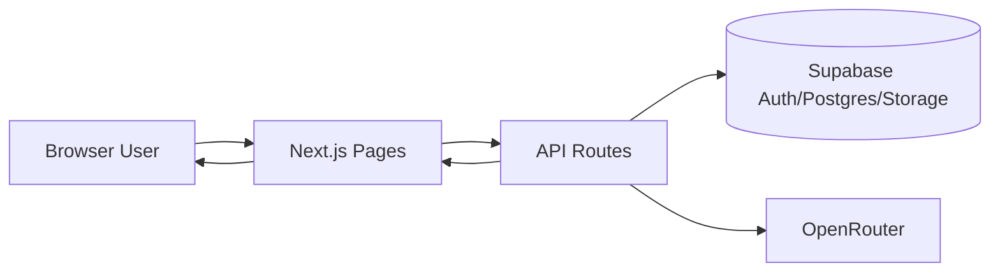
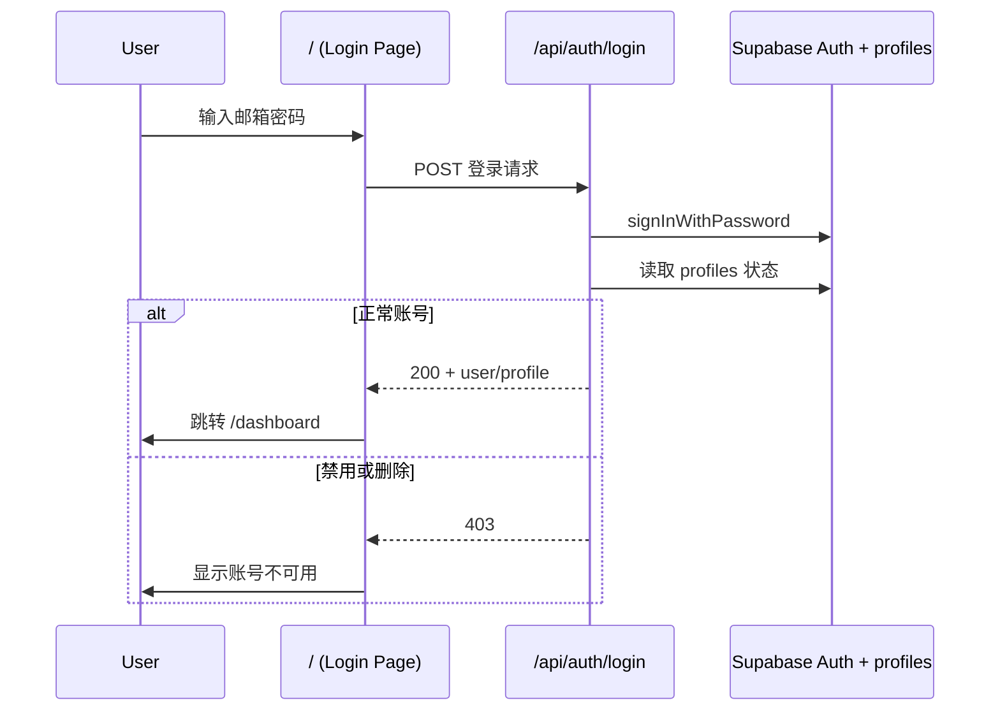
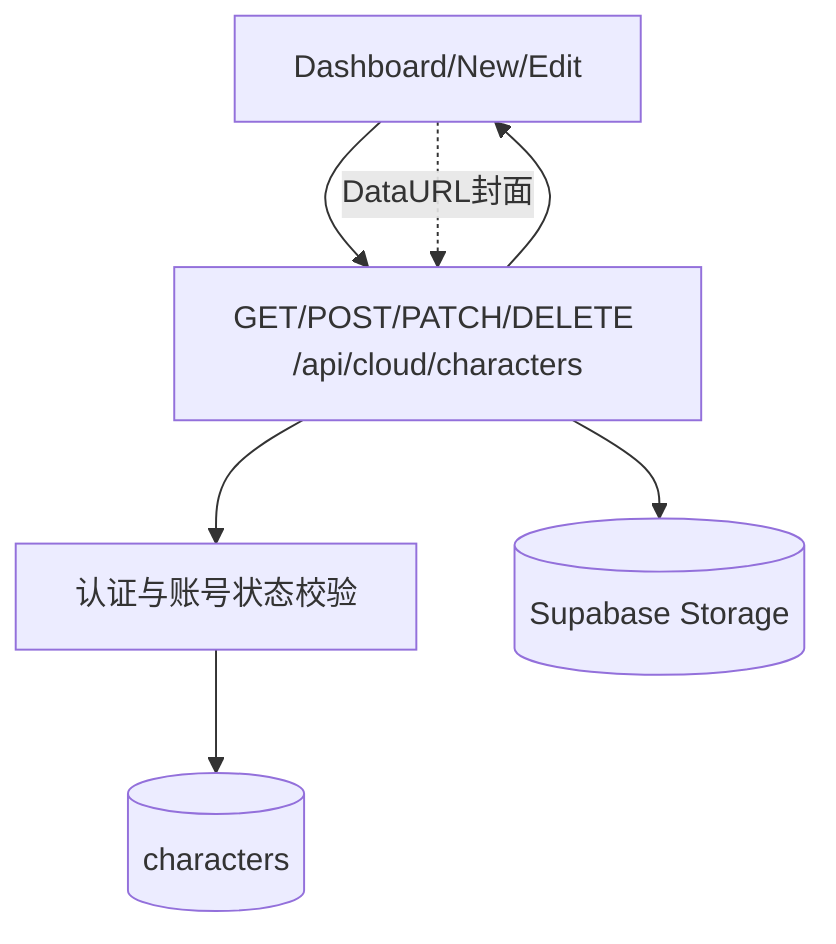
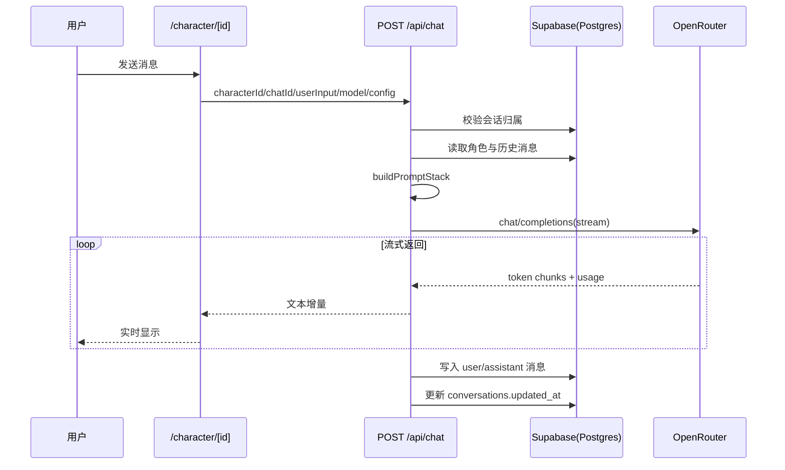
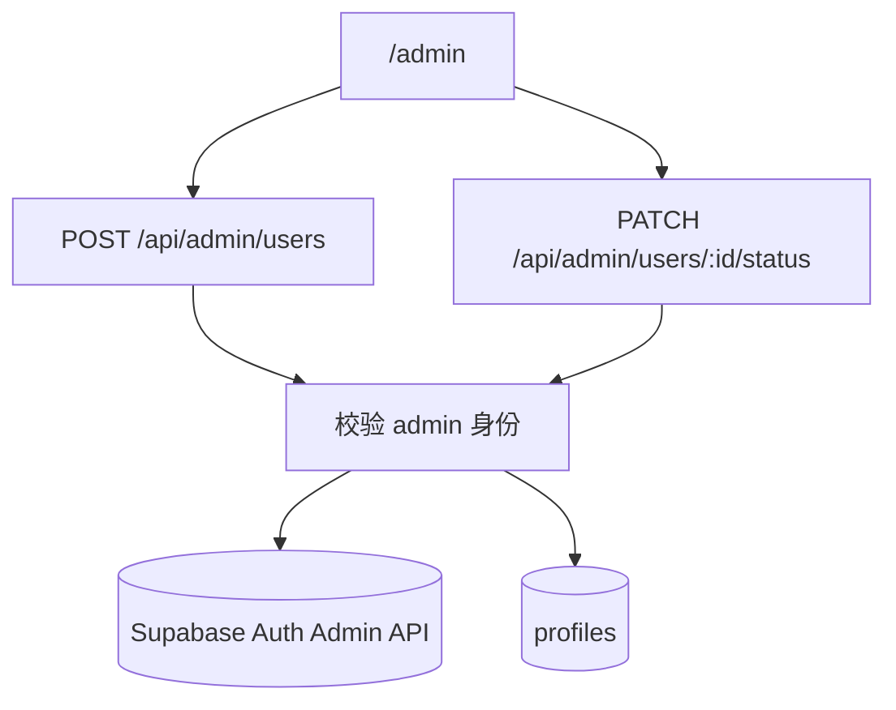
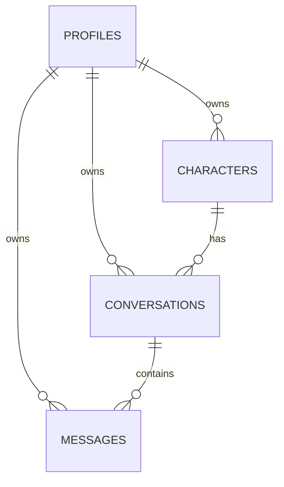

# LightTavern 数据流图

## 1. 总体数据流

```mermaid
flowchart LR
  U[Browser User] --> P[Next.js Pages]
  P --> A[API Routes]
  A --> S[(Supabase Auth/Postgres/Storage)]
  A --> O[OpenRouter]
  A --> P
  P --> U
```

## 2. 登录与会话流

```mermaid
sequenceDiagram
  participant User
  participant Page as / (Login Page)
  participant API as /api/auth/login
  participant SB as Supabase Auth + profiles

  User->>Page: 输入邮箱密码
  Page->>API: POST 登录请求
  API->>SB: signInWithPassword
  API->>SB: 读取 profiles 状态
  alt 正常账号
    API-->>Page: 200 + user/profile
    Page->>User: 跳转 /dashboard
  else 禁用或删除
    API-->>Page: 403
    Page->>User: 显示账号不可用
  end
```

## 3. 角色管理流（CRUD）

```mermaid
flowchart TD
  UI[Dashboard/New/Edit] --> C1[GET/POST/PATCH/DELETE /api/cloud/characters]
  C1 --> Auth[认证与账号状态校验]
  Auth --> DB[(characters)]
  UI -. DataURL封面 .-> C1
  C1 --> Storage[(Supabase Storage)]
  C1 --> UI
```

## 4. 聊天流（核心）

```mermaid
sequenceDiagram
  participant U as 用户
  participant P as /character/[id]
  participant API as POST /api/chat
  participant DB as Supabase(Postgres)
  participant OR as OpenRouter

  U->>P: 发送消息
  P->>API: characterId/chatId/userInput/model/config
  API->>DB: 校验会话归属
  API->>DB: 读取角色与历史消息
  API->>API: buildPromptStack
  API->>OR: chat/completions(stream)
  loop 流式返回
    OR-->>API: token chunks + usage
    API-->>P: 文本增量
    P-->>U: 实时显示
  end
  API->>DB: 写入 user/assistant 消息
  API->>DB: 更新 conversations.updated_at
```

## 5. 管理后台流

```mermaid
flowchart TD
  AdminUI["/admin"] --> AdminAPI1["POST /api/admin/users"]
  AdminUI --> AdminAPI2["PATCH /api/admin/users/:id/status"]
  AdminAPI1 --> Guard["校验 admin 身份"]
  AdminAPI2 --> Guard
  Guard --> SAuth[(Supabase Auth Admin API)]
  Guard --> SDB[(profiles)]
```

## 6. 数据实体关系

```mermaid
erDiagram
  PROFILES ||--o{ CHARACTERS : owns
  PROFILES ||--o{ CONVERSATIONS : owns
  PROFILES ||--o{ MESSAGES : owns
  CHARACTERS ||--o{ CONVERSATIONS : has
  CONVERSATIONS ||--o{ MESSAGES : contains
```
